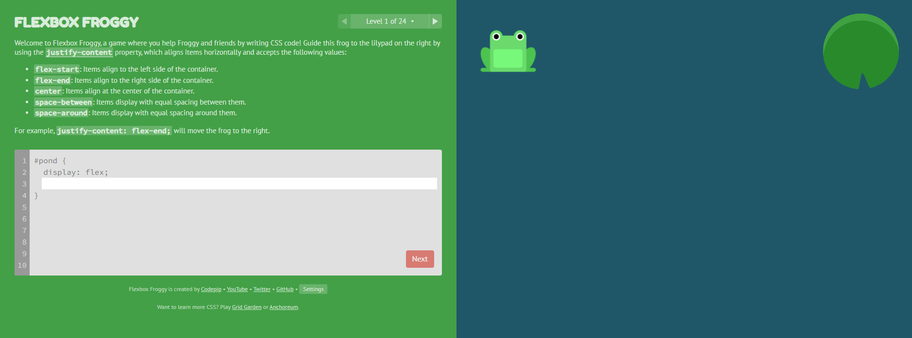

# Flexbox Froggy Answers
Flexbox Froggy lets you learn main basis of Flexible Box layout



🐸 Question 1

### Problem:
Move the frog to the right side of the pond

```css

#pond {
    display: flex;
    justify-content: flex-end;
}

```

🐸 Question 2

### Problem:
Move the frog to the center.

```css

#pond {
    display: flex;
    justify-content: center;
}

```

🐸 Question 3

### Problem:
Spread the frogs evenly with space around them.

```css

#pond {
    display: flex;
    justify-content: space-around;
}


```
🐸 Question 4

### Problem:
Distribute the frogs with equal space between them.

```css

#pond {
    display: flex;
    justify-content: space-between;
}

```
🐸 Question 5

### Problem:
Distribute the frogs with equal space before, between, and after them.

```css

#pond {
    display: flex;
    justify-content: space-evenly;
}

```
🐸 Question 6

### Problem:
Align the frog to the bottom of the pond.

```css

#pond {
    display: flex;
    align-items: flex-end;
}

```
🐸 Question 7

### Problem:
Align the frog to the top of the pond.

```css

#pond {
    display: flex;
    align-items: flex-start;
}

```
🐸 Question 8

### Problem:
Align the frog in the center of the pond.

```css

#pond {
    display: flex;
    align-items: center;
}

```
🐸 Question 9

### Problem:
Align the frog to the bottom while spreading them evenly.

```css

#pond {
    display: flex;
    justify-content: space-around;
    align-items: flex-end;
}

```
🐸 Question 10

### Problem:
Make the frogs stack in a column.

```css

#pond {
    display: flex;
    flex-direction: column;
}

```
🐸 Question 11

### Problem:
Reverse the order of the frogs in a column.

```css

#pond {
    display: flex;
    flex-direction: column-reverse;
}

```
🐸 Question 12

### Problem:
Reverse the order of the frogs in a row.

```css

#pond {
    display: flex;
    flex-direction: row-reverse;
}

```
🐸 Question 13

### Problem:
Make the column centered

```css

#pond {
    display: flex;
    flex-direction: column;
    justify-content: center;
}

```
🐸 Question 14

### Problem:
Align the frogs at the bottom in a column.

```css

#pond {
    display: flex;
    flex-direction: column;
    justify-content: flex-end;
}

```
🐸 Question 15

### Problem:
Stack the frogs in a column and align them to the center.

```css

#pond {
    display: flex;
    flex-direction: column;
    justify-content: center;
    align-items: center;
}

```
🐸 Question 16

### Problem:
Reverse the column order and align them to the start.

```css

#pond {
    display: flex;
    flex-direction: column-reverse;
    justify-content: space-between;
}

```
🐸 Question 17

### Problem:
Set frogs to wrap to a new row when they reach the end.

```css

#pond {
    display: flex;
    flex-wrap: wrap;
}

```
🐸 Question 18

### Problem:
Reverse wrap direction.

```css

#pond {
    display: flex;
    flex-wrap: wrap-reverse;
}

```
🐸 Question 19

### Problem:
Stack elements in columns and allow wrapping.

```css

#pond {
    display: flex;
    flex-flow: column wrap;
}

```
🐸 Question 20

### Problem:
First frog takes more space than others.

```css

.yellow {
    flex-grow: 2;
}

```
🐸 Question 21

### Problem:
The second frog should take more space.

```css

.green {
    flex-grow: 3;
}

```
🐸 Question 22

### Problem:
Set the first frog to not grow at all.

```css

.yellow {
    flex-grow: 0;
}

```
🐸 Question 23

### Problem:
Set all frogs to take equal space.

```css

.frog {
    flex-grow: 1;
}

```
🐸 Question 24

### Problem:
Make the last frog shrink more than others.

```css

.red {
    flex-shrink: 2;
}

```


## 📌 Summary
This guide provides solutions for all 24 levels of Flexbox Froggy with explanations. Understanding these principles will help you master CSS Flexbox and apply it in real-world projects.
